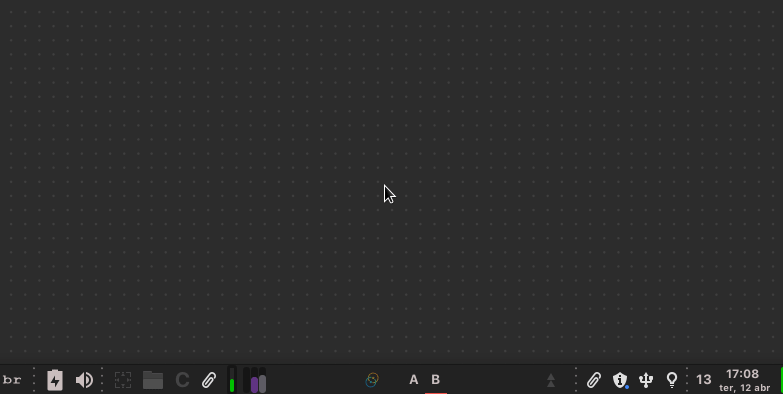

### ▶️ Under development

This app is in an early stage of development. It is a personal project, created with the purpose of testing and learning some technologies in my spare time.

Below are described some things implemented in this project.

---

### ▶️ Features

For now, the main feature ideas implemented or in the implementation stage in this monorepo are just three: (1.) Global authentication service; (2.) Checklist with heatmap calendar; (3.) And fitness tracking integrated with Google Fit and Apple Health.

The app:

<div align="center">
  <a href="https://github.com/ronoctua/routine">
    
  </a>
</div>

---

### ▶️ Monorepo

The repository was implemented to contain large and complex apps in one place. It is a TypeScript focused monorepo implemented with **[NX](https://nx.dev/)** and its default folder structure.

I intend to study Google's **[BAZEL](https://bazel.build/)**, to maybe replace NX with a multi-language monorepo.

---

### ▶️ Authentication

All apps in the repository use the same authentication through **[OpenID Connect](https://en.wikipedia.org/wiki/OpenID)** technology (the same used by Google). In this way, it is possible to perform only one authentication to access apps in completely different domains.

For this implementation, the new **[Middleware](https://nextjs.org/docs/middleware)** resource of **[Next.js](https://nextjs.org/)** and the **[Cognito](https://aws.amazon.com/cognito/)** service from AWS were used. Also, in the future, maybe a **[Lambda](https://aws.amazon.com/lambda/)** code will be implemented to authenticate Cognito by fingerprint.

---

### ▶️ Design system and accessibility

With monorepo it was possible to create a completely isolated Design System to be used in different apps.

The colors and elements were created aiming for the best results in accessibility tests. And to facilitate the creation of the design system, the new library, **[Stitches](https://stitches.dev/)**, was used. Also, in the future, automated tests using **[Cypress](https://www.cypress.io/)** will be implemented.

For documentation, each element is being created with IntelliSense (TSDoc) support for VSCode and other editors. As well, they are being implemented with **[Storybook](https://storybook.js.org/)** support.

And finally, a new Storybook plugin was created specifically for the app. This plugin makes it possible to test multiple themes in a practical and easy way.

<div align="center">
  <a href="https://github.com/ronoctua/routine">
    
  </a>
</div>

<div align="center">
  <a href="https://github.com/ronoctua/routine">
    
  </a>
</div>

<div align="center">
  <a href="https://github.com/ronoctua/routine">
    
  </a>
</div>

---

### ▶️ API and database

The current features were built in a fullstack app, so the backend and frontend are in the same codebase and communicate with each other through Next.js serverless functions and Vercel hosting. In this way, communication between the interface and the backend happens much faster compared to traditional apps.

All app communication is done through GraphQL. For the front-end, **[URQL](https://formidable.com/open-source/urql/)** was used. For the server, **[Apollo Server](https://github.com/apollographql/apollo-server/tree/main/packages/apollo-server-micro)** was implemented. For queries, mutations, schemas, etc, **[Nexus](https://nexusjs.org/)** was used, thus making it possible to write all code in a type-safety way with pure TypeScript. And for communication with the database, **[Prisma](https://www.prisma.io/)** was used.

---

### ▶️ Git

In this project was configured: **[Commitlint](https://github.com/conventional-changelog/commitlint)**, to lint the commits; **[Commitizen](http://commitizen.github.io/cz-cli/)**, to generate visual command-line interaction; and **[Husky](https://typicode.github.io/husky/#/)**, to automate and handle user terminal inputs.

The commit rules adopted for this project were based on the convention used by the Angular team.

<details>

<summary><b>Commit rules (CLICK HERE TO EXPAND)</b></summary>

<div align="center">
  <a href="https://github.com/ronoctua/routine">
    
  </a>
</div>

##### MESSAGE FORMAT

Each commit message consists of a **header**, a **body** and a **footer**. The header has a special format that includes a **type**, a **scope** and a **subject**:

```text
<type>(<optional_scope>): <subject>
<BLANK LINE>
<optional_body>
<BLANK LINE>
<optional_footer>
```

The **header** is mandatory, the **scope** of the header is optional, and the commit message cannot be longer than 100 characters.

##### REVERT

If the commit reverts a previous commit, it should begin with `revert: `, followed by the header of the reverted commit. In the body it should say: `This reverts commit <hash>.`, where the hash is the SHA of the commit being reverted.

##### TYPE

Must be one of the following:

- **revert:** Reverts a previous commit
- **feat:** A new feature
- **fix:** A bug fix
- **docs:** Documentation only changes
- **style:** Changes that do not affect the meaning of the code (white-space, formatting, missing semi-colons, etc)
- **refactor:** A code change that neither fixes a bug nor adds a feature
- **perf:** A code change that improves performance
- **test:** Adding missing or correcting existing tests
- **chore:** Changes to the build process or auxiliary tools and libraries such as documentation generation

##### SCOPE

The scope could be anything specifying place of the commit change. For example `$location`, `$browser`, `$compile`, `$rootScope`, `ngHref`, `ngClick`, `ngView`, etc...

You can use `*` when the change affects more than a single scope.

##### SUBJECT

The subject contains succinct description of the change:

- use the imperative, present tense: "change" not "changed" nor "changes"
- don't capitalize first letter
- no dot (.) at the end

##### BODY

Just as in the subject, use the imperative, present tense: "change" not "changed" nor "changes". The body should include the motivation for the change and contrast this with previous behavior.

##### FOOTER

The footer should contain any information about **Breaking Changes** and is also the place to reference **[GitHub issues that this commit closes](https://docs.github.com/issues/tracking-your-work-with-issues/linking-a-pull-request-to-an-issue)**, example: `close #123`

Breaking Changes should start with the word `BREAKING CHANGE:` with a space or two newlines. The rest of the commit message is then used for this.

</details>

---

### ▶️ Internationalization

For now, the app has English and Portuguese languages. And it has support for translation through domain url routes.

<div align="center">
  <a href="https://github.com/ronoctua/routine">
    
  </a>
</div>

---

### ▶️ Cross-platform

The app has PWA support and also supports the desktop version running with [Tauri](https://tauri.studio/), a security-first platform written in Rust.

Example of the app running with Tauri on desktop:

<div align="center">
  <a href="https://github.com/ronoctua/routine">
    
  </a>
</div>
